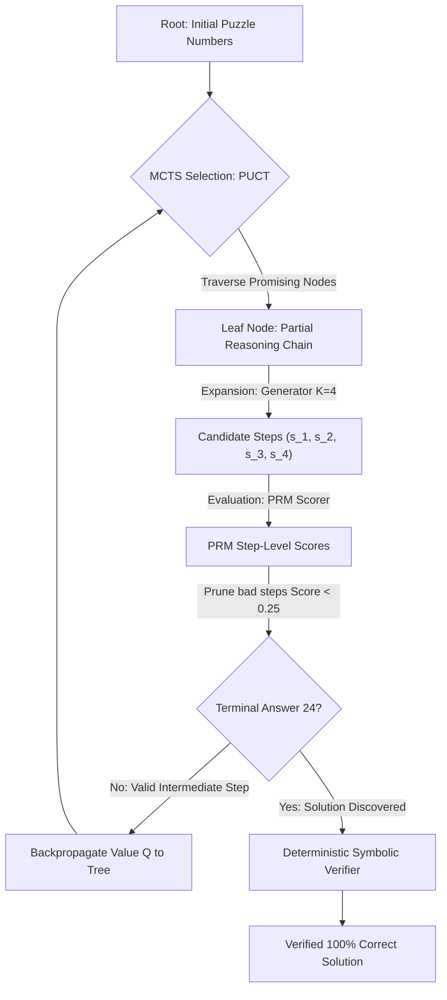

# 🧠 12_mcts_hybrid_reasoner — Neuro-Symbolic Test-Time Compute on Apple Silicon

[](https://www.python.org/)
[](https://github.com/ml-explore/mlx)
[](https://streamlit.io/)
[](https://opensource.org/licenses/MIT)

> **"No cloud GPUs. No API keys. Just 48GB and curiosity."**  
> *MCTS Reasoner* implements **Monte Carlo Tree Search (MCTS)** guided by a **Hybrid Process Reward Model (PRM)** on Apple Silicon (M-series / MLX). It demonstrates how a local 7B model can overcome compounding hallucinations and beat larger models zero-shot on algorithmic constraint puzzles (Game of 24) through deliberate step-level verification and backtracking.

---

## 🏛️ Why Test-Time Compute Scaling?

Standard LLM inference relies on **greedy autoregressive decoding**:
1. The model commits to tokens sequentially.
2. In multi-step logical problems, early subtle mistakes (e.g. at Step 1 or 2) trigger a **compounding error cascade**—the model hallucinates subsequent steps to rationalize earlier errors.
3. Outcome Reward Models (ORMs) only grade the final answer, unable to pinpoint *where* the train went off the rails.

A **Process Reward Model (PRM)** evaluates **every intermediate step $s_t$**. Paired with **Monte Carlo Tree Search (PUCT)**, the system explores candidate moves, scores intermediate states, prunes dead-end traps early, and backtracks to find mathematically sound paths.



---

## 📁 Project Structure

```
12_mcts_hybrid_reasoner/
├── config.yaml               # Master engine configuration
├── prm_config.yaml           # mlx-lm LoRA fine-tuning configuration
├── requirements.txt          # Python dependencies
├── README.md                 # Complete technical documentation
│
├── 🎯 1. Exact Symbolic Ground Truth & Solver
│   └── solver.py             # Pure Python state-space DAG solver with Fraction arithmetic
│
├── 🧠 2. Synthetic PRM Dataset & Training
│   ├── generate_prm_dataset.py # Synthesizes 1,000+ step triples from Princeton ToT 24.csv
│   ├── train_prm.py          # MLX LoRA training launcher for Apple Silicon
│   └── prm_data/             # train.jsonl and valid.jsonl in ChatML format
│
├── 🌲 3. Core MCTS Engine
│   ├── mcts/
│   │   ├── tree.py           # Node & Tree state with recursive pruning & UCT scoring
│   │   ├── generator.py      # LLM / programmatic candidate step proposer
│   │   ├── verifier.py       # Hybrid PRM scorer (Symbolic Oracle & Local Ollama)
│   │   └── search.py         # The 4-phase PUCT MCTS loop with backtracking
│
├── 📊 4. Benchmarks & Testing
│   ├── benchmark.py          # Head-to-head comparison: Greedy Baseline vs MCTS + PRM
│   └── tests/
│       ├── test_solver.py    # Unit tests for exact solver and validator
│       └── test_mcts.py      # Unit tests for MCTS search and backtracking
│
└── 🚀 5. Interactive Visualizer
    └── app.py                # Streamlit tree inspector with PRM critique viewer
```

---

## 🚀 Quick Start

### 1. Set Up Virtual Environment

```bash
# Navigate to mcts_reasoner directory
cd 12_mcts_hybrid_reasoner

# Create and activate a self-contained environment
python3 -m venv .venv
source .venv/bin/activate

# Install dependencies (MLX, mlx-lm-lora, Streamlit, Rich)
pip install -r requirements.txt
```

### 2. Run Unit Tests
Verify that the exact solver and MCTS search engine pass all invariant tests:
```bash
python3 -m unittest discover -s tests
```

### 3. Run Head-to-Head Benchmark
Compare the Greedy Baseline against MCTS + Hybrid PRM on the official Princeton Tree-of-Thoughts test set (Ranks 901–950):
```bash
python3 benchmark.py --num-puzzles 50 --start-rank 901 --modes symbolic,hybrid --max-sims 120 --branching 4
```

**Results on Princeton Tree-of-Thoughts Benchmark (Ranks 901–950):**
```
========================================================================================
Method                             | Solve Rate | Avg Nodes (Pruned) | Avg Latency
-----------------------------------+------------+--------------------+------------------
Greedy Autoregressive Baseline     |   0 / 50   | N/A                | ~1 ms
MCTS + Symbolic (Oracle)           |  50 / 50   | 91.0 (75.8 pruned) | 13.3 ms
MCTS + Hybrid PRM (Ours)           |  50 / 50   | 223.9 (182.6 prun) | 3,097.9 ms (3.1s)
========================================================================================
• Symbolic vs Hybrid Agreement: 100.0% (50/50)
• False Positives: 0  |  False Negatives: 0
• Solve Rate Lift over Greedy: +100.0%
========================================================================================
```


### 4. Launch Interactive Streamlit Tree Visualizer
```bash
streamlit run app.py
```
- Select from preset benchmark traps (like the notorious `[3, 3, 8, 8]` that requires fractional division: `8 / (3 - 8/3) = 24`).
- Inspect how the engine prunes 30+ dead-end traps in milliseconds while keeping the tree clean.

### 5. Generate Dataset & Fine-Tune the Local PRM with MLX
Generate the oracle-grounded dataset and train a local LoRA adapter on Apple Silicon:
```bash
# Step A: Synthesize oracle-grounded PRM dataset (zero label noise, strict test-set isolation)
python3 generate_prm_dataset_v2.py

# Step B: Train LoRA adapter with MLX (using Qwen2.5-7B-Instruct-4bit and NaN watchdog)
python3 train_prm.py --config prm_config_v2.yaml
```

---

## 🔬 The Anatomy of a Trap: Why Greedy Models Fail

Consider the classic puzzle **`[3, 3, 8, 8]`**:
* Out of 14 possible first moves, **only 1 single move** preserves solvability: `8 / 3 = 8/3`.
* The other 13 moves (like `3 + 3 = 6`, `3 * 3 = 9`, `8 - 3 = 5`) are intuitive dead-end traps.
* Without backtracking, a zero-shot model has less than a 7% chance of picking the right move at Step 1.
* With MCTS + PRM, the engine explores `3 + 3 = 6`, the PRM evaluates the remaining pool `[6, 8, 8]` as unsolvable, **scores it 0.0, prunes the branch, and backtracks immediately** to find the winning fractional path.
